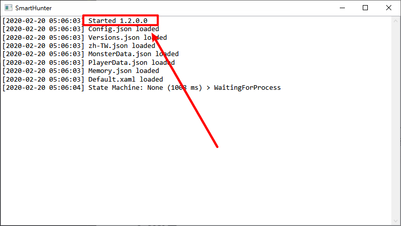

# SmartHunter zh-TW Translate
 SmartHunter 繁體中文語言包  
 請依照版本下載對應的繁體中文語言包  
 如何查詢版本號([?](#qa))  
## 如何使用
  1. 請先下載 [SmartHunter](https://github.com/gabrielefilipp/SmartHunter) 
  2. 依照 SmartHunter 版本下載對應資料夾下的語言包並放入與 SmartHunter 同目錄
  3. 修改 `Config.json` 中的 `LocalizationFileName` (應位在第二行) 值為 `zh-TW.json`  
  `"LocalizationFileName": "en-US.json"` 改為 `"LocalizationFileName": "zh-TW.json"`
  4. 重新啟動 SmartHunter
  5. 享受~
## Q&A
 1. 如何查詢版本號?  
   開啟 SmartHunter 後的第一行可以查看目前版本號碼